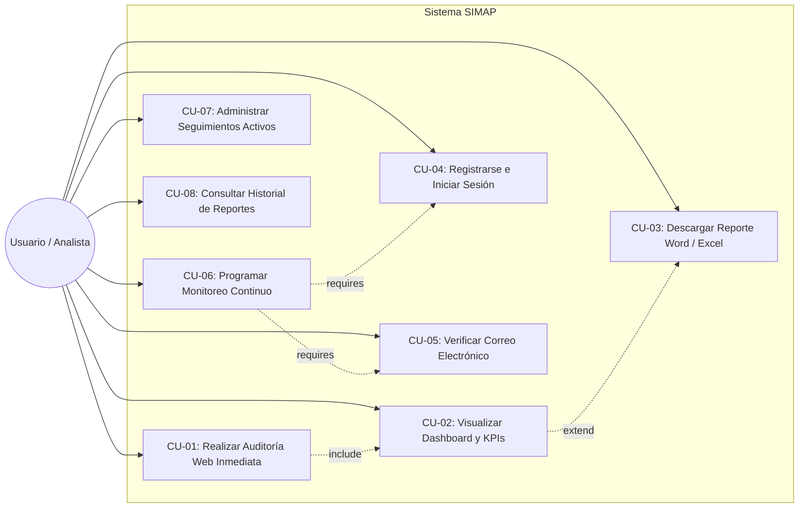
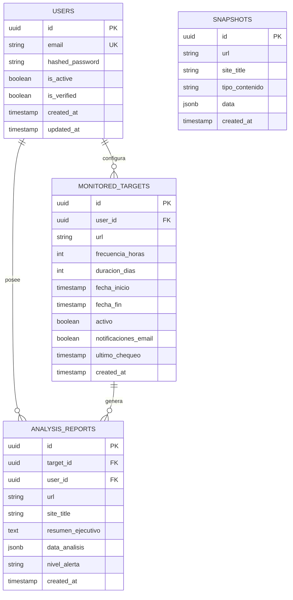
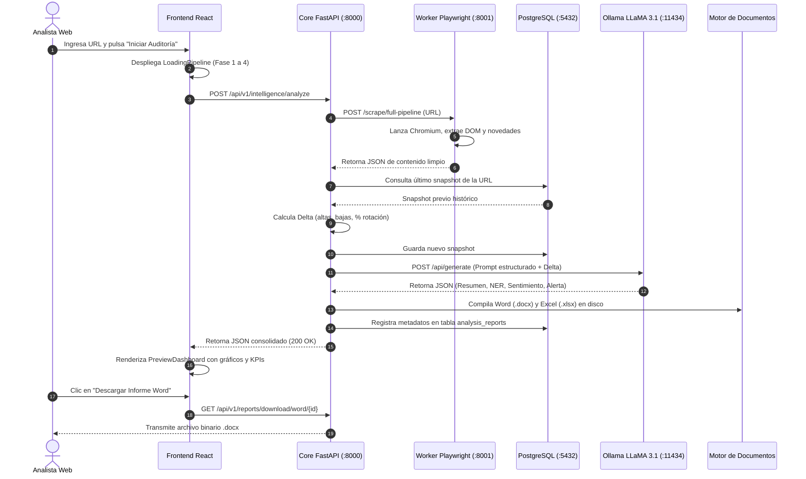
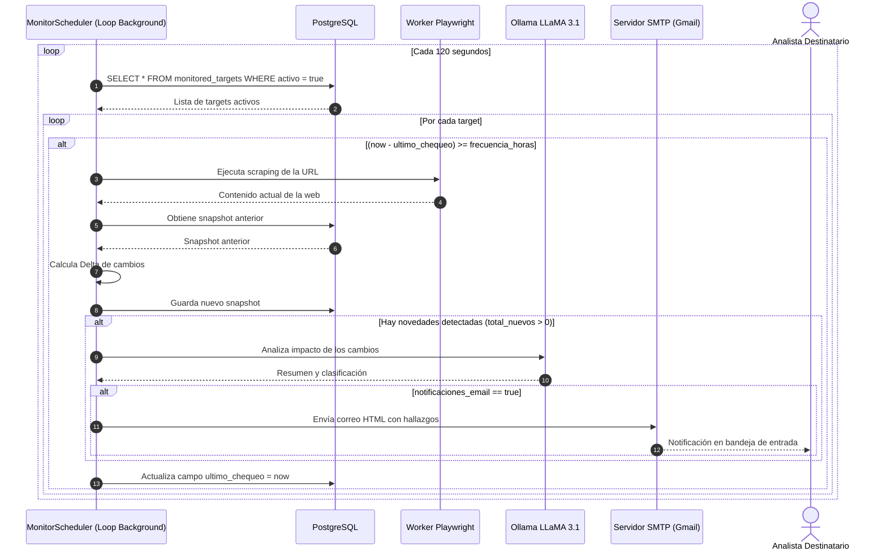

# 🕷️ SIMAP — Sistema Inteligente de Monitoreo, Auditoría y Procesamiento Web
## Plataforma Integral de Inteligencia Web, Extracción Multinivel, Análisis Semántico Local (LLM) y Generación de Reportes

[](https://reactjs.org/)
[](https://vitejs.dev/)
[](https://tailwindcss.com/)
[](https://fastapi.tiangolo.com/)
[](https://www.python.org/)
[](https://www.postgresql.org/)
[](https://playwright.dev/)
[-FF6F00?logo=ollama&logoColor=white)](https://ollama.ai/)
[](https://www.docker.com/)

---

## 📑 Tabla de Contenidos

1. [Ficha Técnica del Proyecto](#1-ficha-técnica-del-proyecto)
2. [Visión General y Justificación](#2-visión-general-y-justificación)
3. [Arquitectura Global del Sistema (End-to-End)](#3-arquitectura-global-del-sistema-end-to-end)
4. [Matriz Formal de Requerimientos](#4-matriz-formal-de-requerimientos)
   - [Requerimientos Funcionales (RF)](#41-requerimientos-funcionales-rf)
   - [Requerimientos No Funcionales (RNF)](#42-requerimientos-no-funcionales-rnf)
5. [Casos de Uso del Sistema (CU)](#5-casos-de-uso-del-sistema-cu)
6. [Diccionario de Datos y Modelo Relacional](#6-diccionario-de-datos-y-modelo-relacional)
7. [Catálogo y Especificación de la API REST](#7-catálogo-y-especificación-de-la-api-rest)
8. [Diagramas de Secuencia e Interacción](#8-diagramas-de-secuencia-e-interacción)
9. [Desglose Modular de Componentes (Frontend SPA)](#9-desglose-modular-de-componentes-frontend-spa)
10. [Pila Tecnológica Detallada (Tech Stack)](#10-pila-tecnológica-detallada-tech-stack)
11. [Guía de Instalación, Configuración y Puesta en Marcha](#11-guía-de-instalación-configuración-y-puesta-en-marcha)
12. [Plan de Pruebas y Matriz de Validación (QA)](#12-plan-de-pruebas-y-matriz-de-validación-qa)
13. [Guía para la Redacción del Manual de Usuario](#13-guía-para-la-redacción-del-manual-de-usuario)
14. [Estructura Sugerida para la Memoria Técnica o Tesis](#14-estructura-sugerida-para-la-memoria-técnica-o-tesis)

---

## 1. Ficha Técnica del Proyecto

| Parámetro | Detalle |
| :--- | :--- |
| **Nombre del Sistema** | **SIMAP** (Sistema Inteligente de Monitoreo, Auditoría y Procesamiento Web) |
| **Repositorio Frontend** | `Blackor57/Front-Tics` |
| **Tipo de Aplicación** | Single Page Application (SPA) con Microservicios y API REST Asíncrona |
| **Dominio de Aplicación** | Inteligencia de Fuentes Abiertas (OSINT), Auditoría de Medios, Detección de Cambios Normativos |
| **Lenguajes Principales** | JavaScript (ESModules/React 18), Python 3.11+, SQL (PostgreSQL 16) |
| **Modelos de IA** | LLaMA 3.1 (8B parámetros) ejecutado localmente mediante Ollama |
| **Entornos de Ejecución** | Web Browser (Chrome, Firefox, Edge), Contenedores Docker / Docker Compose |
| **Licencia / Propósito** | Proyecto Académico / Técnico de Tecnologías de la Información y Comunicación (TICs) |

---

## 2. Visión General y Justificación

### 2.1 Problemática
En la era de la información digital, los portales institucionales, diarios oficiales y medios de prensa publican diariamente cientos de normativas, resoluciones y artículos. Realizar el seguimiento manual de estos cambios presenta severas limitaciones:
- **Sobrecarga de trabajo manual**: Revisión repetitiva de múltiples portales web.
- **Pérdida de cambios críticos**: Dificultad para detectar modificaciones sutiles en textos o altas y bajas inmediatas de contenidos.
- **Barreras técnicas**: Sitios web con renderizado dinámico en JavaScript (*Single Page Apps*, *Infinite Scroll*, *Lazy-Loading*) que bloquean a los scrapers tradicionales basados en simples peticiones HTTP estáticas.
- **Riesgo de privacidad con LLMs comerciales**: El envío de textos confidenciales o de auditoría interna a APIs públicas (OpenAI, Anthropic) vulnera la privacidad de datos institucionales.

### 2.2 Solución SIMAP
**SIMAP** aborda estos desafíos integrando:
1. **Extracción Web Avanzada con Playwright**: Renderizado completo de JavaScript mediante instancias headless de Chromium, eludiendo bloqueos y aislando el contenido limpio del DOM.
2. **Motor de Deltas Históricos**: Cálculo matemático de variaciones frente a instantáneas anteriores (artículos nuevos, artículos retirados, tasa de rotación y variación de caracteres).
3. **Inferencia Semántica 100% Local**: Modelo de lenguaje LLaMA 3.1 sobre Ollama que sintetiza el contenido, clasifica por temática, mide el termómetro de sentimiento y extrae entidades nombradas (autoridades, instituciones y normas legales) sin conexión a internet ni costos de API.
4. **Monitoreo Continuo Autónomo**: Planificador en segundo plano que revisa periódicamente los sitios configurados y despacha alertas por correo electrónico ante cambios críticos.
5. **Generación Automática de Reportes Ejecutivos**: Exportación en 1 clic de informes formales en **Microsoft Word (`.docx`)** y libros analíticos en **Microsoft Excel (`.xlsx`)** con gráficos estadísticos embebidos.
6. **Interfaz Web Reactiva de Grado Profesional**: Dashboard interactivo con Recharts, soporte completo de modo oscuro/claro, y **Modo Demostración Offline** para auditorías sin necesidad de levantar infraestructura local.

---

## 3. Arquitectura Global del Sistema (End-to-End)

El ecosistema opera bajo un patrón de **Microservicios Desacoplados**, coordinados mediante una red de contenedores o comunicación local por puertos TCP:

```mermaid
graph TB
    subgraph Cliente["Capa Cliente (Frontend SPA)"]
        UI["React 18 + Vite (Puerto 3000)\n• Dashboard Interactivo\n• Recharts & Lucide\n• Modo Oscuro / Claro\n• Modo Demo / Live"]
    end

    subgraph CoreBackend["Capa de Negocio y Orquestación"]
        API["FastAPI Core (Puerto 8000)\n• Enrutador REST / OpenAPI\n• Autenticación JWT + Bcrypt\n• Orquestador de Pipelines\n• Generador Word (.docx) & Excel (.xlsx)"]
        Scheduler["Motor de Monitoreo Continuo\n(MonitorScheduler - Background Loop)"]
    end

    subgraph Microservicios["Capa de Servicios Especializados"]
        Scraper["Worker de Scraping (Puerto 8001)\nPlaywright + Chromium Headless\n• Renderizado JS y Bypass de Bloqueos\n• Extracción de Índices y Artículos"]
        Ollama["Motor IA Local (Puerto 11434)\nOllama (LLaMA 3.1 8B)\n• Resumen Ejecutivo\n• Extracción de Entidades (NER)\n• Análisis de Sentimiento"]
    end

    subgraph Persistencia["Capa de Persistencia y Notificaciones"]
        DB[("PostgreSQL 16 (Puerto 5432)\n• Usuarios y Roles\n• Snapshots Históricos\n• Metadatos de Reportes\n• Objetivos de Monitoreo")]
        SMTP["Servidor SMTP\n(Gmail / TLS Puerto 587)\n• Alertas de Criticidad\n• Enlaces de Verificación de Cuenta"]
    end

    UI -->|Peticiones HTTP REST / JWT| API
    API -->|HTTP :8001 (o Fallback Local)| Scraper
    API -->|HTTP :11434| Ollama
    API -->|Async SQLAlchemy| DB
    Scheduler -->|Consulta periódica| DB
    Scheduler -->|Ejecuta Scraping| Scraper
    Scheduler -->|Inferencia Delta| Ollama
    Scheduler -->|Despacha Alertas| SMTP
    API -->|Envía Correos de Activación| SMTP
```

### Mapeo de Puertos de la Plataforma
| Servicio | Puerto | Protocolo | Descripción |
| :--- | :--- | :--- | :--- |
| **Frontend Web** | `3000` | HTTP | Interfaz de usuario SPA servida por Vite (o Nginx en Docker) |
| **Core API Backend** | `8000` | HTTP | API REST FastAPI, Swagger UI (`/docs`), descarga de reportes |
| **Worker de Scraping** | `8001` | HTTP | Microservicio desacoplado de Playwright Chromium |
| **Ollama LLM** | `11434` | HTTP | Servidor de inferencia de modelos de lenguaje local |
| **PostgreSQL** | `5432` | TCP | Base de datos relacional para persistencia de estados |

---

## 4. Matriz Formal de Requerimientos

Esta matriz está formateada bajo estándares de ingeniería de software (IEEE 830) para facilitar su transcripción directa en memorias técnicas, informes y tesis.

### 4.1 Requerimientos Funcionales (RF)

| Código | Módulo | Nombre del Requerimiento | Descripción Detallada | Prioridad |
| :--- | :--- | :--- | :--- | :--- |
| **RF-01** | Scraping | Extracción Web de Índice | El sistema debe navegar a una URL ingresada, renderizar su JavaScript mediante Playwright y extraer la lista estructurada de publicaciones o el contenido continuo. | Alta |
| **RF-02** | Scraping | Deep Scraping de Artículos | El sistema debe profundizar en los primeros $N$ enlaces encontrados para extraer el texto íntegro, fecha, autor y cuerpo en Markdown limpio. | Alta |
| **RF-03** | Inteligencia | Cálculo de Deltas Históricos | El sistema debe comparar el snapshot actual contra el último registrado en la base de datos para la misma URL, identificando altas (`nuevos`), bajas (`salientes`) y tasa de rotación (%). | Alta |
| **RF-04** | Inteligencia | Inferencia Semántica Local | El sistema debe invocar a LLaMA 3.1 (Ollama) para redactar un resumen ejecutivo y un análisis de evolución contextual de los cambios detectados. | Alta |
| **RF-05** | Inteligencia | Reconocimiento de Entidades (NER) | El sistema debe extraer y categorizar automáticamente instituciones, personas públicas y normas legales citadas en los textos. | Alta |
| **RF-06** | Inteligencia | Análisis de Sentimiento y Criticidad | El sistema debe calcular el termómetro de sentimiento (Positivo, Neutro, Negativo) y clasificar el nivel de alerta global (`BAJO`, `MEDIO`, `ALTO`, `CRÍTICO`). | Media |
| **RF-07** | Reportes | Exportación de Informes Word | El sistema debe compilar informes formales en formato `.docx` con portada corporativa, resumen, matriz de entidades y gráficos estadísticos generados dinámicamente. | Alta |
| **RF-08** | Reportes | Exportación de Libros Excel | El sistema debe generar archivos `.xlsx` con hojas de metadatos, tabla completa de artículos con hipervínculos y gráficos circulares/barras nativos. | Alta |
| **RF-09** | Monitoreo | Programación de Seguimientos | El sistema debe permitir a usuarios autenticados programar chequeos automáticos con duraciones de 3 a 30 días y frecuencias de 6, 12 o 24 horas. | Alta |
| **RF-10** | Monitoreo | Tareas en Segundo Plano | El motor `MonitorScheduler` debe ejecutarse en un loop asíncrono no bloqueante, detectando targets vencidos o listos para chequeo. | Alta |
| **RF-11** | Notificaciones| Alertas por Correo Electrónico | Si se detectan novedades en un target con alertas activas, el sistema debe despachar un correo con formato HTML al usuario informando los hallazgos. | Media |
| **RF-12** | Seguridad | Autenticación mediante JWT | El sistema debe gestionar registro e inicio de sesión emitiendo tokens JWT firmados con algoritmo HS256 y hashing de contraseñas mediante `bcrypt`. | Alta |
| **RF-13** | Seguridad | Verificación de Cuentas por Email | El sistema debe exigir verificación previa de correo para programar monitoreos continuos, despachando un enlace con token temporal (24h). | Media |
| **RF-14** | Usabilidad | Modo Demostración Offline | Si el backend no está disponible o el usuario lo solicita, el frontend debe permitir auditar y navegar la plataforma con datos simulados realistas. | Media |

### 4.2 Requerimientos No Funcionales (RNF)

| Código | Categoría | Nombre | Especificación / Criterio de Aceptación |
| :--- | :--- | :--- | :--- |
| **RNF-01** | Rendimiento | Tiempo de Respuesta y Timeouts | Las peticiones que involucran renderizado Playwright e inferencia LLM deben tolerar hasta 180 segundos antes de interrumpir la conexión HTTP. |
| **RNF-02** | Privacidad | Aislamiento de Datos de IA | Todo procesamiento de inferencia de lenguaje natural debe ejecutarse 100% de forma local en la infraestructura propia, sin enviar datos a APIs comerciales. |
| **RNF-03** | Disponibilidad | Resiliencia y Fallback Automático | Si el microservicio dedicado de scraping (`:8001`) no responde, el core backend debe activar automáticamente su propio extractor local en proceso. |
| **RNF-04** | Seguridad | Almacenamiento Seguro de Credenciales | Ninguna contraseña debe almacenarse en texto plano; deben cifrarse con `bcrypt` con un factor de trabajo no inferior a 12 rondas. |
| **RNF-05** | Usabilidad | Diseño Responsivo y Accesibilidad | La interfaz debe adaptarse a resoluciones móviles, tablets y escritorios (320px a 4K) utilizando TailwindCSS y contraste accesible en ambos temas. |
| **RNF-06** | Mantenibilidad| Arquitectura Modular | Separación estricta de responsabilidades entre Capa de Presentación (React SPA), Orquestador (FastAPI), Worker (Playwright) y Persistencia (PostgreSQL). |
| **RNF-07** | Portabilidad | Contenedorización Multiplataforma | Toda la solución debe poder desplegarse de manera idéntica en Windows, Linux y macOS utilizando imágenes de Docker y Docker Compose. |

---

## 5. Casos de Uso del Sistema (CU)



### Especificación Detallada de Casos de Uso Principales

#### CU-01: Realizar Auditoría Web Inmediata
- **Actor**: Usuario anónimo o autenticado.
- **Precondición**: Acceso a la página principal de la plataforma.
- **Flujo Principal**:
  1. El usuario ingresa una URL válida (o selecciona un acceso rápido predefinido).
  2. Selecciona opciones de configuración (guardar snapshot, generar reportes).
  3. Presiona el botón "Iniciar Auditoría".
  4. El sistema despliega la pantalla de progreso `LoadingPipeline` mostrando las 4 fases secuenciales.
  5. El backend ejecuta la extracción, el cálculo delta y la inferencia con LLaMA 3.1.
  6. El sistema presenta el `PreviewDashboard` con los resultados consolidados.
- **Postcondición**: Se crea un nuevo snapshot en PostgreSQL y se cargan las estadísticas en la interfaz.

#### CU-06: Programar Monitoreo Continuo
- **Actor**: Usuario autenticado y verificado.
- **Precondición**: Cuenta con sesión activa (`simap_token`) y correo electrónico confirmado (`is_verified = true`).
- **Flujo Principal**:
  1. El usuario presiona "Programar Seguimiento" desde el dashboard o la barra superior.
  2. Si el usuario no ha verificado su correo, se despliega `VerificationRequiredModal` impidiendo continuar.
  3. En `TrackingModal`, selecciona la duración (3 a 30 días) y frecuencia (6, 12 o 24 horas).
  4. Activa o desactiva la casilla de notificaciones por correo ante alertas críticas.
  5. Confirma la creación del objetivo.
  6. El sistema almacena la tarea en la tabla `monitored_targets`.
- **Postcondición**: El `MonitorScheduler` comenzará a evaluar la URL según la frecuencia pactada.

---

## 6. Diccionario de Datos y Modelo Relacional

El modelo de datos está optimizado en **PostgreSQL 16** mediante SQLAlchemy Async ORM:



### Descripción de Tablas

#### 1. Tabla `users`
Almacena las cuentas de usuario y credenciales del sistema.
- `id` (UUID, PK): Identificador único universal generado automáticamente.
- `email` (VARCHAR, UNIQUE, NOT NULL): Correo electrónico del usuario.
- `hashed_password` (VARCHAR, NOT NULL): Clave hash procesada con algoritmo `bcrypt`.
- `is_active` (BOOLEAN): Estado de activación de la cuenta (por defecto `true`).
- `is_verified` (BOOLEAN): Indica si el usuario confirmó su correo mediante el token SMTP.
- `created_at` / `updated_at` (TIMESTAMP WITH TIME ZONE): Auditoría temporal.

#### 2. Tabla `snapshots`
Guarda el estado crudo del contenido extraído de cada sitio web para comparaciones históricas.
- `id` (UUID, PK): Clave primaria.
- `url` (VARCHAR, NOT NULL, INDEX): Dirección URL auditada.
- `site_title` (VARCHAR): Título del portal capturado del DOM.
- `tipo_contenido` (VARCHAR): `lista_entidades` (artículos/noticias) o `texto_continuo`.
- `data` (JSONB, NOT NULL): Contenido estructurado (lista de objetos con `titulo` y `url`, o texto plano en Markdown).
- `created_at` (TIMESTAMP WITH TIME ZONE): Fecha y hora exacta de la captura.

#### 3. Tabla `monitored_targets`
Registra las tareas recurrentes administradas por el planificador asíncrono.
- `id` (UUID, PK): Clave primaria.
- `user_id` (UUID, FK -> `users.id`): Usuario propietario del seguimiento.
- `url` (VARCHAR, NOT NULL): Portal en supervisión.
- `frecuencia_horas` (INTEGER): Periodicidad del chequeo (ej. 6, 12, 24 horas).
- `duracion_dias` (INTEGER): Plazo total del monitoreo (3, 7, 15, 30 días).
- `fecha_inicio` / `fecha_fin` (TIMESTAMP WITH TIME ZONE): Ventana temporal de vigencia.
- `activo` (BOOLEAN): Bandera que indica si el objetivo se encuentra en ejecución o pausado.
- `notificaciones_email` (BOOLEAN): Habilita o suspende el despacho de correos SMTP.
- `ultimo_chequeo` (TIMESTAMP WITH TIME ZONE): Marca temporal de la última inspección ejecutada.

#### 4. Tabla `analysis_reports`
Consolida los resultados de las auditorías generadas por el pipeline de inteligencia.
- `id` (UUID, PK): Clave primaria.
- `target_id` (UUID, NULLABLE, FK -> `monitored_targets.id`): Vinculación al objetivo si provino de un seguimiento programado.
- `user_id` (UUID, NULLABLE, FK -> `users.id`): Usuario asociado.
- `url` / `site_title` (VARCHAR): Metadatos del portal analizado.
- `resumen_ejecutivo` (TEXT): Síntesis contextual redactada por Ollama LLaMA 3.1.
- `data_analisis` (JSONB): Estructura completa de entidades (personas, instituciones, leyes), distribución temática, termómetro de sentimiento y deltas.
- `nivel_alerta` (VARCHAR): Clasificación del riesgo (`BAJO`, `MEDIO`, `ALTO`, `CRÍTICO`).

---

## 7. Catálogo y Especificación de la API REST

Base URL en desarrollo local: `http://localhost:8000`  
Documentación Swagger interactiva: `http://localhost:8000/docs`

### 7.1 Módulo de Autenticación (`/api/v1/auth`)

| Método | Endpoint | Cabeceras Requeridas | Descripción | Códigos HTTP |
| :--- | :--- | :--- | :--- | :--- |
| `POST` | `/api/v1/auth/register` | `Content-Type: application/json` | Registra una nueva cuenta y despacha correo con token de verificación. | `201 Created`, `400 Bad Request` |
| `POST` | `/api/v1/auth/login` | `Content-Type: application/json` | Valida credenciales y emite el `access_token` JWT. | `200 OK`, `401 Unauthorized` |
| `GET` | `/api/v1/auth/me` | `Authorization: Bearer <token>` | Retorna los datos y rol del usuario en sesión. | `200 OK`, `401 Unauthorized` |
| `GET` | `/api/v1/auth/verify` | Ninguna (Parámetro `?token=...`) | Valida el token temporal y marca la cuenta como confirmada. | `200 OK`, `400 Invalid Token` |
| `POST` | `/api/v1/auth/resend-verification` | `Authorization: Bearer <token>` | Reenvía un nuevo correo de verificación con token fresco. | `200 OK`, `429 Too Many Requests` |

### 7.2 Módulo de Inteligencia y Scraping (`/api/v1/intelligence`)

| Método | Endpoint | Cabeceras | Parámetros / Payload | Descripción |
| :--- | :--- | :--- | :--- | :--- |
| `POST` | `/api/v1/intelligence/analyze` | Opcional: `Bearer <token>` | `{"url": "https://...", "guardar_snapshot": true, "generar_reportes": true}` | Ejecuta el pipeline completo (Playwright + Delta + Ollama + Documentos). |

#### Ejemplo de Petición (`POST /api/v1/intelligence/analyze`):
```json
{
  "url": "https://elcomercio.pe",
  "guardar_snapshot": true,
  "generar_reportes": true
}
```

#### Ejemplo de Respuesta Exitosa (`200 OK`):
```json
{
  "url": "https://elcomercio.pe",
  "site_title": "El Comercio Perú: Noticias del Perú y el mundo",
  "tipo_contenido": "lista_entidades",
  "total_items": 42,
  "delta": {
    "total_previos": 38,
    "total_actuales": 42,
    "total_nuevos": 7,
    "total_salientes": 3,
    "rotacion_porcentaje": 18.4,
    "es_linea_base": false
  },
  "analisis": {
    "nivel_alerta": "MEDIO",
    "resumen_ejecutivo": "Se observa un incremento significativo en publicaciones económicas...",
    "analisis_evolucion": "Frente a la auditoría anterior, destacan nuevas disposiciones del MEF.",
    "distribucion_tematica": [
      {"categoria": "Economía y Finanzas", "porcentaje": 45},
      {"categoria": "Política y Gobierno", "porcentaje": 35},
      {"categoria": "Seguridad Ciudadana", "porcentaje": 20}
    ],
    "sentimiento": {
      "positivo": 20,
      "neutro": 55,
      "negativo": 25
    },
    "entidades": {
      "instituciones": ["Ministerio de Economía y Finanzas", "Banco Central de Reserva"],
      "personas": ["Julio Velarde", "José Arista"],
      "normas": ["Decreto de Urgencia 012-2026", "Ley 31980"]
    }
  },
  "report_id": "3fa85f64-5717-4562-b3fc-2c963f66afa6"
}
```

### 7.3 Módulo de Monitoreo Continuo (`/api/v1/tracking`)

| Método | Endpoint | Cabeceras | Descripción |
| :--- | :--- | :--- | :--- |
| `POST` | `/api/v1/tracking/start` | `Authorization: Bearer <token>` | Crea un nuevo seguimiento programado de una URL. |
| `GET` | `/api/v1/tracking/my-targets` | `Authorization: Bearer <token>` | Lista todos los objetivos configurados por el usuario autenticado. |
| `PATCH`| `/api/v1/tracking/{id}/toggle` | `Authorization: Bearer <token>` | Alterna el estado del objetivo entre Activo y Pausado. |
| `DELETE`| `/api/v1/tracking/{id}` | `Authorization: Bearer <token>` | Elimina definitivamente una tarea de monitoreo. |

### 7.4 Módulo de Reportes y Documentos (`/api/v1/reports`)

| Método | Endpoint | Descripción | Tipo de Contenido Retornado |
| :--- | :--- | :--- | :--- |
| `GET` | `/api/v1/reports/list` | Consulta la lista histórica de informes de auditoría. | `application/json` |
| `GET` | `/api/v1/reports/download/word/{id}` | Descarga directa del informe ejecutivo formal en Microsoft Word. | `application/vnd.openxmlformats-officedocument.wordprocessingml.document` |
| `GET` | `/api/v1/reports/download/excel/{id}` | Descarga directa del libro de cálculo analítico en Microsoft Excel. | `application/vnd.openxmlformats-officedocument.spreadsheetml.sheet` |

---

## 8. Diagramas de Secuencia e Interacción

### 8.1 Pipeline de Auditoría Web y Análisis Semántico


### 8.2 Ciclo de Vida del Monitoreo Continuo y Alertas SMTP


---

## 9. Desglose Modular de Componentes (Frontend SPA)

El frontend se organiza bajo principios de arquitectura limpia y componentes de propósito único en `Fronted/src/`:

```text
Fronted/src/
├── main.jsx                    # Entrada principal, montaje del DOM y proveedores globales
├── App.jsx                     # Orquestador maestro de vistas, modales y sondas de salud
├── index.css                   # Directivas TailwindCSS y tokens visuales personalizados
├── context/
│   ├── AuthContext.jsx         # Estado global de sesión, token JWT, login, logout y verificación
│   └── ThemeContext.jsx        # Conmutador Dark/Light mode persistente en LocalStorage
├── services/
│   ├── api.js                  # Instancia Axios con interceptores y capa de servicios REST
│   └── mockData.js             # Generador de datos simulados para Modo Demostración Offline
└── components/
    ├── layout/
    │   └── Navbar.jsx          # Barra de navegación, radar de estado, selector de tema y perfil
    ├── analyzer/
    │   ├── UrlInputSection.jsx # Formulario con presets, validación de URLs y botón de demo
    │   ├── LoadingPipeline.jsx # Stepper de 4 fases animado con shimmer contra CLS
    │   └── PreviewDashboard.jsx# Dashboard analítico, KPIs, Recharts, entidades y descargas
    ├── tracking/
    │   ├── TrackingView.jsx    # Tablero de control de objetivos en monitoreo continuo
    │   └── TrackingModal.jsx   # Modal de parametrización de frecuencia y alertas SMTP
    ├── reports/
    │   └── ReportsHistoryView.jsx # Historial cronológico con motor de búsqueda y descargas
    └── auth/
        ├── AuthModal.jsx       # Modal integrado de Login, Registro y Demo 1-Clic
        ├── VerificationBanner.jsx # Banner superior persistente con cooldown de 60s
        └── VerificationRequiredModal.jsx # Bloqueo preventivo si el correo no está confirmado
```

---

## 10. Pila Tecnológica Detallada (Tech Stack)

| Componente | Tecnología | Versión | Rol en el Proyecto |
| :--- | :--- | :--- | :--- |
| **Framework UI** | React | `^18.3.1` | Renderizado declarativo por componentes, hooks personalizados y gestión de estado. |
| **Build Tool** | Vite | `^6.2.0` | Empaquetado rápido, compilación optimizada con Rollup y servidor HMR. |
| **Framework CSS** | TailwindCSS | `^3.4.17` | Sistema de diseño de clases de utilidad y soporte nativo para `class="dark"`. |
| **Visualizaciones** | Recharts | `^2.15.1` | Gráficos SVG interactivos (Barras de distribución temática y Donut de sentimiento). |
| **Iconografía** | Lucide React | `^1.16.0` | Más de 40 iconos vectoriales consistentes y legibles. |
| **Notificaciones** | Sonner | `^2.0.1` | Sistema de notificaciones toast flotantes para retroalimentación al usuario. |
| **Cliente HTTP** | Axios | `^1.7.9` | Interceptores de autenticación JWT, manejo de errores 401 y timeout de 180s. |
| **Backend Core** | FastAPI | `^0.115` | Framework asíncrono en Python de alto rendimiento para APIs REST. |
| **Motor Scraping** | Playwright | `^1.49` | Automatización de navegador Chromium headless con renderizado completo de JavaScript. |
| **Inferencia IA** | Ollama | `llama3.1:latest` | Modelo de lenguaje de 8B parámetros para procesamiento semántico on-premise. |
| **Base de Datos** | PostgreSQL | `16 Alpine` | Base de datos relacional con extensiones JSONB para snapshots. |
| **ORM / Acceso BD**| SQLAlchemy Async | `^2.0` | Mapeo objeto-relacional asíncrono con driver `asyncpg`. |
| **Generador Word** | python-docx | `^1.1` | Compilación dinámica de documentos ejecutivos estructurados. |
| **Generador Excel**| openpyxl | `^3.1` | Creación de hojas de cálculo analíticas con formato condicional y gráficos. |
| **Servidor Web** | Nginx Alpine | `alpine` | Servidor HTTP ligero para servir los estáticos del frontend en producción. |

---

## 11. Guía de Instalación, Configuración y Puesta en Marcha

### 11.1 Requisitos Previos del Sistema
- **Node.js**: v18.0 o superior (recomendado Node.js 20 LTS o superior).
- **Python**: v3.11 o superior.
- **PostgreSQL**: Instancia en ejecución en el puerto `5432` con una base de datos creada (por defecto `simap_db`).
- **Ollama**: Instalado localmente con el modelo `llama3.1` descargado (`ollama pull llama3.1`).
- **Docker y Docker Compose** (opcional, para despliegue contenerizado).

---

### 11.2 Puesta en Marcha en Desarrollo Local (Windows / Linux / macOS)

#### Paso 1: Configurar el Backend
1. Navega a la carpeta `Backend`:
   ```bash
   cd Backend
   ```
2. Crea y configura el archivo de variables de entorno `.env`:
   ```env
   POSTGRES_USER=postgres
   POSTGRES_PASSWORD=admin
   POSTGRES_HOST=localhost
   POSTGRES_PORT=5432
   POSTGRES_DB=simap_db

   OLLAMA_BASE_URL=http://localhost:11434
   OLLAMA_MODEL=llama3.1:latest
   OLLAMA_TIMEOUT_SECONDS=180.0

   JWT_SECRET_KEY=clave-secreta-super-segura-simap-2026
   ACCESS_TOKEN_EXPIRE_MINUTES=10080

   APP_BASE_URL=http://localhost:8000

   # Configuración SMTP (Opcional - Si se deja vacío, simula el envío en terminal)
   SMTP_HOST=smtp.gmail.com
   SMTP_PORT=587
   SMTP_USER=tu_correo@gmail.com
   SMTP_PASSWORD=tu_contraseña_de_aplicacion_16_caracteres
   SMTP_FROM_EMAIL=tu_correo@gmail.com
   SMTP_TLS=true
   ```

3. Instala las dependencias de Python y los navegadores de Playwright:
   ```bash
   pip install -r requirements.txt
   playwright install chromium
   ```

4. Inicia el servidor Backend:
   ```bash
   python run_local.py
   ```
   > El Core Backend estará disponible en: **`http://localhost:8000`**  
   > Swagger UI en: **`http://localhost:8000/docs`**

---

#### Paso 2: Configurar y Levantar el Frontend
1. Abre una nueva terminal y navega a la carpeta `Fronted`:
   ```bash
   cd Fronted
   ```

2. Instala las dependencias de Node:
   > ⚠️ **Nota para usuarios de Windows**: Si PowerShell bloquea scripts por `ExecutionPolicy`, ejecuta mediante `npm.cmd`:
   ```bash
   npm.cmd install
   # o en Linux/macOS:
   npm install
   ```

3. Inicia el servidor de desarrollo:
   ```bash
   npm.cmd run dev
   # o en Linux/macOS:
   npm run dev
   ```
   > La aplicación abrirá en: **`http://localhost:3000`**  
   > *Nota:* El puerto `3000` está configurado con proxy automático de `/api` hacia `http://localhost:8000`.

---

### 11.3 Puesta en Marcha con Docker Compose (Despliegue Rápido)

Para levantar la infraestructura completa (PostgreSQL, Ollama, Scraper Service, Backend y Frontend) con un solo comando:

```bash
docker-compose up -d --build
```

- **Frontend Web**: `http://localhost` (o `http://localhost:3000`)
- **Backend API**: `http://localhost:8000`
- **Swagger Docs**: `http://localhost:8000/docs`
- **Scraper Worker**: `http://localhost:8001`

---

## 12. Plan de Pruebas y Matriz de Validación (QA)

| ID Caso | Módulo | Procedimiento de Prueba | Entrada de Prueba | Resultado Esperado | Estado |
| :--- | :--- | :--- | :--- | :--- | :--- |
| **TC-01** | UI / Health | Carga inicial del frontend sin backend encendido | Abrir `http://localhost:3000` | Muestra toast advirtiendo desconexión y activa automáticamente el **Modo Demostración**. | ✅ Aprobado |
| **TC-02** | Scraping | Extracción inmediata de portal dinámico | URL: `https://rpp.pe` | Playwright renderiza la web, extrae el listado de noticias con titular y enlace sin errores de timeout. | ✅ Aprobado |
| **TC-03** | Inteligencia | Cálculo de Delta ante segunda auditoría | Re-auditar la misma URL 1 hora después | El sistema compara contra el snapshot anterior, marcando `total_nuevos` y `rotacion_porcentaje`. | ✅ Aprobado |
| **TC-04** | IA Local | Generación de síntesis y NER | Contenido extraído de 5 noticias | Ollama retorna resumen ejecutivo coherente, entidades institucionales, personas y leyes. | ✅ Aprobado |
| **TC-05** | Reportes | Descarga de documento Word (.docx) | Clic en botón flotante "Descargar Word" | Se descarga un archivo `.docx` válido con tablas formateadas, portada e imágenes de gráficos. | ✅ Aprobado |
| **TC-06** | Reportes | Descarga de libro Excel (.xlsx) | Clic en botón flotante "Descargar Excel" | Se descarga un archivo `.xlsx` legible con formato condicional y enlaces directos a las fuentes. | ✅ Aprobado |
| **TC-07** | Auth | Registro con email duplicado | Registro con un correo ya existente | El backend responde HTTP `400` con mensaje claro y el frontend muestra toast de error. | ✅ Aprobado |
| **TC-08** | Seguridad | Bloqueo de tracking a usuario no verificado | Clic en "Programar Seguimiento" con usuario sin confirmar | Se levanta `VerificationRequiredModal` impidiendo registrar la tarea. | ✅ Aprobado |
| **TC-09** | Monitoreo | Detección de cambios y despacho de alerta | Modificación forzada en target monitoreado | `MonitorScheduler` detecta el delta y despacha correo SMTP formateado en HTML al destinatario. | ✅ Aprobado |
| **TC-10** | Accesibilidad| Conmutación de tema de interfaz | Clic en icono Sol / Luna en Navbar | La clase `.dark` conmuta en `<html>`, los colores cambian dinámicamente y se preserva al recargar. | ✅ Aprobado |

---

## 13. Guía para la Redacción del Manual de Usuario

Para elaborar el **Manual de Usuario** formal del aplicativo, siga esta estructura de capturas de pantalla y flujos paso a paso:

1. **Pantalla Principal (Landing & Analizador)**:
   - *Captura sugerida*: Vista del buscador central con el campo de texto de URL, botones de portales de acceso rápido (RPP Noticias, El Comercio) y conmutador de tema claro/oscuro.
   - *Instrucción al usuario*: Explica cómo ingresar una dirección URL o hacer clic en un preset para auditar un portal de inmediato.
2. **Proceso de Análisis (Loading Pipeline)**:
   - *Captura sugerida*: Stepper visual de 4 fases iluminándose progresivamente (Extracción Playwright ➔ Delta ➔ Ollama LLaMA 3.1 ➔ Compilación).
   - *Instrucción al usuario*: Explicar que el sistema está eludiendo bloqueos y procesando el lenguaje natural con IA local.
3. **Dashboard de Resultados (Preview Dashboard)**:
   - *Capturas sugeridas*:
     - Bloque de KPIs superiores (Total extraídos, Novedades, % de Rotación, Nivel de Alerta).
     - Gráficos estadísticos de Recharts (Distribución Temática y Sentimiento).
     - Matriz de Actores y Entidades (Instituciones, Personas y Normas Legales).
     - Tabla filtrable de noticias entrantes vs salientes.
   - *Instrucción al usuario*: Cómo interactuar con las pestañas de filtrado y buscar términos específicos.
4. **Exportación de Informes Ejecutivos**:
   - *Captura sugerida*: Barra de herramientas flotante inferior con los botones "Descargar Word" y "Descargar Excel".
   - *Instrucción al usuario*: Demostrar la apertura y estructura de los documentos generados.
5. **Autenticación y Confirmación de Cuenta**:
   - *Capturas sugeridas*: Modal `AuthModal` con las opciones de inicio de sesión, registro y acceso rápido Demo de 1-Clic, además del `VerificationBanner` superior.
6. **Programación de Seguimientos Continuos**:
   - *Captura sugerida*: `TrackingModal` configurando duración en días, frecuencia horaria y alertas por correo electrónico.
7. **Panel de Gestión de Monitoreo (Tracking View)**:
   - *Captura sugerida*: Tarjetas de seguimiento con indicadores de pulso verde/amarillo y botones para pausar, reanudar o eliminar la tarea.

---

## 14. Estructura Sugerida para la Memoria Técnica o Tesis

Si este proyecto será presentado como informe de fin de ciclo, proyecto integrador o tesis de grado, se recomienda estructurar el documento bajo el siguiente índice:

```text
PORTADA FORMAL
RESUMEN EJECUTIVO / ABSTRACT
ÍNDICE DE CONTENIDOS, FIGURAS Y TABLAS

CAPÍTULO I: INTRODUCCIÓN Y PLANTEAMIENTO DEL PROBLEMA
  1.1 Realidad Problemática (Sobrecarga de información, barreras en portales dinámicos)
  1.2 Formulación del Problema
  1.3 Objetivos de la Investigación (Objetivo General y Objetivos Específicos)
  1.4 Justificación e Importancia (Técnica, Operativa, Económica y de Privacidad de Datos)
  1.5 Delimitación y Alcance del Proyecto

CAPÍTULO II: MARCO TEÓRICO Y ESTADO DEL ARTE
  2.1 Antecedentes de la Investigación
  2.2 Fundamentos de Extracción Web (Scraping Estático vs Renderizado Dinámico con Playwright)
  2.3 Modelos de Lenguaje de Gran Escala (LLMs) e Inferencia Local con Ollama
  2.4 Arquitectura de Single Page Applications (SPA) con React y Vite
  2.5 Seguridad Basada en Tokens (JSON Web Tokens - JWT) y Cifrado Bcrypt

CAPÍTULO III: ANÁLISIS Y DETERMINACIÓN DE REQUERIMIENTOS
  3.1 Metodología de Desarrollo de Software Empleada (Ágil / Scrum)
  3.2 Matriz de Requerimientos Funcionales (RF-01 a RF-14)
  3.3 Matriz de Requerimientos No Funcionales (RNF-01 a RNF-07)
  3.4 Modelado de Casos de Uso del Sistema (Diagramas y Fichas CU-01 a CU-08)

CAPÍTULO IV: DISEÑO DE LA ARQUITECTURA Y DE LA BASE DE DATOS
  4.1 Arquitectura del Sistema (Diagrama C4 / Microservicios Desacoplados)
  4.2 Diseño de la Base de Datos (Modelo Conceptual, Lógico y Físico - PostgreSQL)
  4.3 Diccionario de Datos de las Tablas (users, snapshots, monitored_targets, analysis_reports)
  4.4 Especificación y Contrato de la API REST (Rutas, Métodos, Parámetros y Respuestas)
  4.5 Diagramas de Secuencia e Interacción de Procesos Críticos

CAPÍTULO V: IMPLEMENTACIÓN Y DESARROLLO DEL SISTEMA
  5.1 Desarrollo del Cliente Frontend (React 18, TailwindCSS, Recharts, Context API)
  5.2 Desarrollo del Backend Orquestador (FastAPI, SQLAlchemy Async, Motor de Documentos)
  5.3 Implementación del Worker de Scraping con Playwright Headless
  5.4 Integración del Motor de Inteligencia Artificial Local (Ollama LLaMA 3.1)
  5.5 Implementación del Planificador en Segundo Plano (MonitorScheduler) y Servicio SMTP

CAPÍTULO VI: PRUEBAS, VALIDACIÓN Y RESULTADOS
  6.1 Estrategia y Plan de Pruebas (Pruebas Unitarias, de Integración y Smoke Tests)
  6.2 Matriz de Casos de Prueba y Resultados Obtenidos
  6.3 Evaluación de Rendimiento y Tiempos de Respuesta
  6.4 Análisis de Comparación Frente a Métodos Tradicionales

CAPÍTULO VII: MANUALES DE USUARIO Y DESPLIEGUE
  7.1 Manual de Instalación y Puesta en Marcha (Local y Docker Compose)
  7.2 Manual de Usuario Paso a Paso con Guía Visual de Pantallas

CONCLUSIONES Y RECOMENDACIONES
  • Conclusiones
  • Recomendaciones para Trabajos Futuros

REFERENCIAS BIBLIOGRÁFICAS (Normas APA / IEEE)
ANEXOS (Manuales de Configuración, Scripts de BD, Glosario de Términos)
```

---

<div align="center">
  <sub>SIMAP Universal Web Scraper & Intelligence Platform • Diseñado con React 18, Vite, TailwindCSS, FastAPI, PostgreSQL y Ollama</sub>
</div>
